# Equirectangular画像の中からマーカーを検出する
Equirectangular画像(パノラマ画像)は球面に全天周を貼り付けるために歪みが発生している．  
今回作成したものは
- 歪んでいても検出できるマーカー
- マーカーをEquirectangular画像のランダムな位置に埋め込むプログラム
- マーカー検出アルゴリズム
## 目的
***
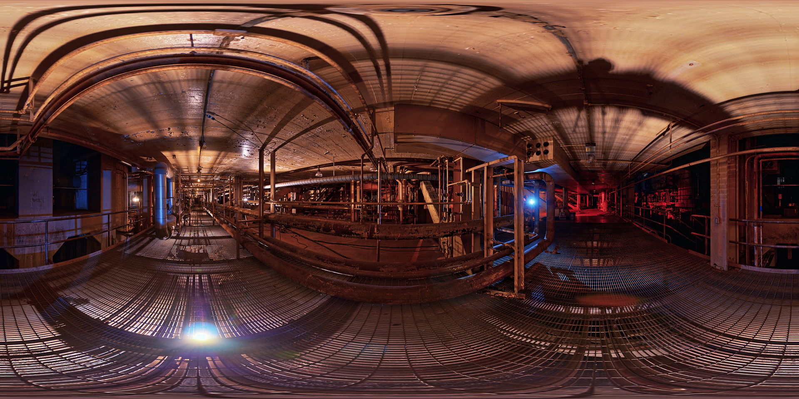  

<!-- -->

全天球カメラで撮影した映像をEquirectangular形式で保存し，別の映像との合成や差分をとることを考える．  
全天球カメラが十分に固定されていないと中心の位置がずれてしまうため，どの程度中心がぶれているかを計算したい．  
最終的にはこのEquirectangular画像をUnityの球面に貼り付けたときに中心のブレをオフセット補正して違和感なく表示したい．

## マーカー
***
- 歪みとして拡大されることが多かった
- 目的の都合上Yaw方向の回転量を主に検出したい

という都合から回転対称かつ中央側に自己相似形をもつような構造のマーカーを作ることを考えた．
[](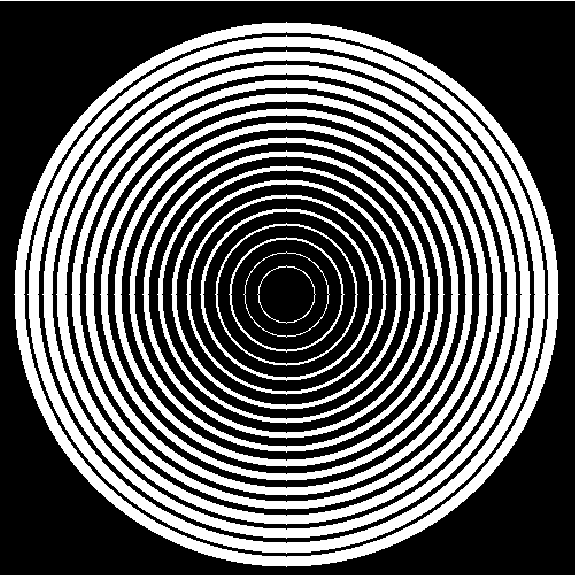)  
  
そこでこんなものを作ってみたが線が細すぎてちゃんと検出してくれなかったりしたので  
[](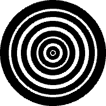)  
  

今度はこんなものを作った．がいまいち性能が良くなかったので任意角回転対称である図形(円の入れ子)をあきらめて，  
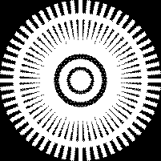  
[]()  
こんな形のものを作った．中の線は60本入ってるので6度ごとに回転対称になっている．入れ子っぽい構造にはあまりなってないがまあだいたい検出できてるしこれを使うことにした...つもりだったが，のちに述べる特徴量マッチングでホモグラフィ行列を計算するタイミングで姿勢がわからないマーカーってまずいんじゃないかと思い文字を追加して姿勢もわかるように変更した．(対応が後手後手...)  
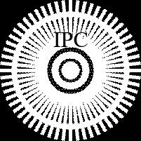  
[]()  
他にも既存のARマーカーとかいろいろ試してみたがいまいちだったのでこれを使うことにした．マーカーに関してはもっといいものがあるとはずなのでまだまだ調整の余地があると思う．

## キューブマップにマーカーを埋め込みテスト画像を生成する
*** 
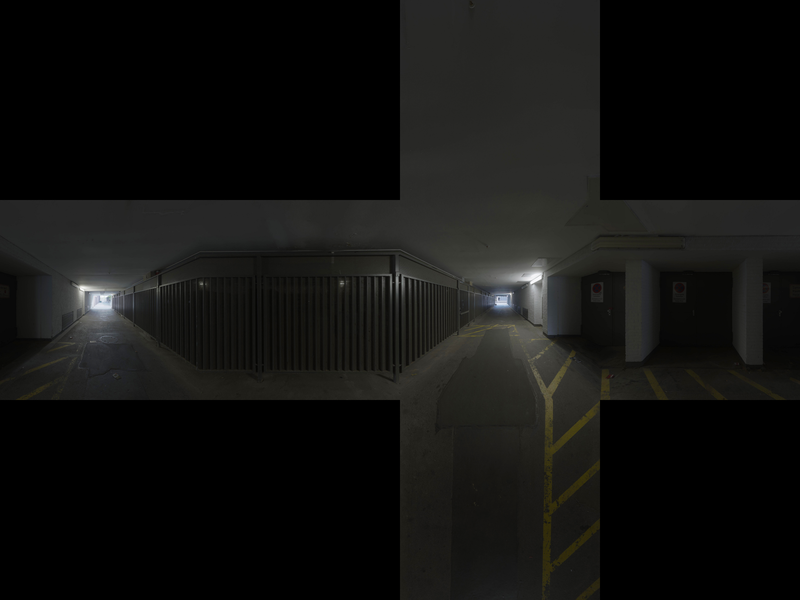  
<!--[]()-->
この節でやるのはこんな感じのキューブマップにさっきのマーカーを埋め込んでEquirectangular変換すること．  

キューブマップの黒いとこ(画像がないところ)にマーカーが被ってしまうとマーカーに欠損が生じるので，そこにマーカーが被らないように例外処理した．
```python:EqMatchingLib.py
def AddMarkerInCubemap(filename,template,position):
    img=cv2.imread(filename)
    r,c,*ch=img.shape
    Mat=np.float32([[1,0,position[0]],[0,1,position[1]]])
    dst=cv2.warpAffine(template,Mat,(c,r),img,cv2.INTER_LINEAR,cv2.BORDER_TRANSPARENT)        
    return img


def SetPosition(FaceSize,w_template,h_template):
    position=np.zeros(2)
    while(1):
        #left
        position[0]=random()*(4*FaceSize-w_template)
        #top
        position[1]=random()*(3*FaceSize-h_template)
    
        #position[0]が2*FaceSizeから3*FaceSize-w_templateの間ならposition[1]は0から3*FaceSize-h_templateの間
        if(2*FaceSize<position[0]<3*FaceSize-w_template):
            if(0<position[1]<3*FaceSize-h_template):
                break
    
        #それ以外ならposition[1]はFaceSizeから2*FaceSize-h_templateの間
        else:
            if(FaceSize<position[1]<2*FaceSize-h_template):
                break
    position[0]=int(position[0])
    position[1]=int(position[1])

    return position
```

これでキューブマップにマーカーが貼りついたので，この画像をEquirectangular展開すればテスト用の画像ができる．  
キューブマップからEquirectangularへの変換は[ここ](https://github.com/adamb70/Python-Spherical-Projection)を参考にした．

## 検出アルゴリズム
*** 
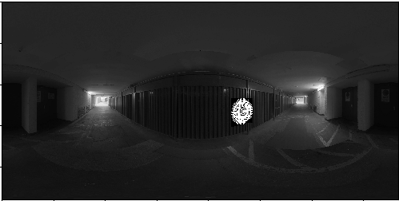  

<!--  -->
この節でやるのは図のような画像からマーカーを検出すること．

### テンプレートマッチング

```python:EqMatchingLib.py
def TMatching(Eq_Input,template):
    #Template Matching
    tmp=0
    template=cv2.cvtColor(template,cv2.COLOR_BGR2GRAY)
    template=template.astype('float32')
    
    img_CV=Eq_Input
    #img_CV=img_CV*255
    #img_CV=img_CV.astype('uint8')
    res = cv2.matchTemplate(img_CV,template,eval('cv2.TM_CCOEFF'))
    min_val, max_val, min_loc, max_loc = cv2.minMaxLoc(res)
    top_left = max_loc
    pts_eq=[]
    h2,w2,*c2=img_CV.shape
    wmark,hmark,*ch1=template.shape
    """
    #図形推定
    posxeq,posyeq=top_left
    px,py = find_corresponding_pixel(int(posxeq),int(posyeq),h2,w2,int(w2*3/4))
    print(posxeq,posyeq)
    print(px,py)
    pts_eq.append([posxeq,posyeq])
    print(wmark,hmark)
    coordx,coordy = find_Cubemap_corresponding_pixel(int(px+wmark),int(py),h2,w2,int(w2*3/4))
    pts_eq.append([coordx,coordy])
    coordx,coordy = find_Cubemap_corresponding_pixel(int(px+wmark),int(py+hmark),h2,w2,int(w2*3/4))
    pts_eq.append([coordx,coordy])
    coordx,coordy = find_Cubemap_corresponding_pixel(int(px),int(py+hmark),h2,w2,int(w2*3/4))
    pts_eq.append([coordx,coordy])
    pts_eq=np.array(pts_eq)
    print(pts_eq)
    """
    img=img_CV
    bottom_right = (top_left[0] + wmark, top_left[1] + hmark)
    img=cv2.cvtColor(img,cv2.COLOR_GRAY2BGR)
    #cv2.polylines(img,[pts_eq],True,(0,0,1),thickness=10)
    cv2.rectangle(img,top_left, bottom_right, (1,0,0),20)
    img=cv2.cvtColor(img,cv2.COLOR_BGR2RGB)
    plt.imshow(img)
    plt.show()
```

テンプレートの大きさを引数に取っているのでサイズも調整できるはず(コメントアウトしているところ)
があまりうまくいかなかったので元のサイズで検出している．  
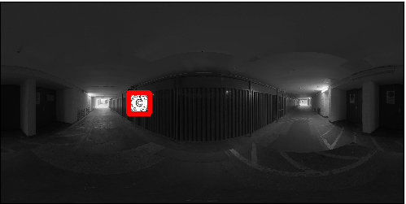  
なので歪みが小さいとうまくいくが，
テンプレートが大きくひずむとうまく検出できない．

### akaze特徴量を用いたマッチング
```python:EqMatchingLib.py
# A-KAZE
def akazeMatching(Eq_Input,template):
    # A-KAZE検出器の生成
    akaze = cv2.AKAZE_create()                                

    img2=Eq_Input
    img2=img2*255
    img2=cv2.cvtColor(img2,cv2.COLOR_GRAY2BGR)
    img2=img2.astype('uint8')

    img1=template
    # 特徴量の検出と特徴量ベクトルの計算
    kp1, des1 = akaze.detectAndCompute(img1, None)
    kp2, des2 = akaze.detectAndCompute(img2, None)

    # Brute-Force Matcher生成
    bf = cv2.BFMatcher()

    # 特徴量ベクトル同士をBrute-Force＆KNNでマッチング
    matches = bf.knnMatch(des1, des2, k=2)
    # Sort them in the order of their distance.
    mlist=sorted([(n.distance-m.distance ,m,n) for m,n in matches],key=lambda x:x[0])
          
    #五点の加算平均でマーカーの中心座標を推定
    EstMarkerCenter=np.zeros(2)
    for i in range(0,5):
        EstMarkerCenter=EstMarkerCenter+np.float32([kp2[mlist[i][1].trainIdx].pt])
    EstMarkerCenter=EstMarkerCenter/5
    
    #マーカー中心の推定座標
    posxeq=np.int32(EstMarkerCenter)[0][0]
    posyeq=np.int32(EstMarkerCenter)[0][1]
    #h=width/3,facesize=width/4
    w2,h2,*ch2=img2.shape
    """
    #left-top estimation
    #print(posxeq,posyeq)
    pts_eq=[]
    px,py = find_corresponding_pixel(int(posxeq),int(posyeq),h2,w2,int(w2*3/4))
    pts_eq.append([posxeq,posyeq])
    wmark,hmark,*ch1=template.shape
    coordx,coordy = find_Cubemap_corresponding_pixel(int(px+wmark),int(py),h2,w2,int(w2*3/4))
    pts_eq.append([coordx,coordy])
    coordx,coordy = find_Cubemap_corresponding_pixel(int(px+wmark),int(py+hmark),h2,w2,int(w2*3/4))
    pts_eq.append([coordx,coordy])
    coordx,coordy = find_Cubemap_corresponding_pixel(int(px),int(py+hmark),h2,w2,int(w2*3/4))
    pts_eq.append([coordx,coordy])
    pts_eq=np.array(pts_eq)
    """
        
    #center estimation
    pts_eq=[]
    px,py = find_corresponding_pixel(int(posxeq),int(posyeq),h2,w2,int(w2*3/4))
    wmark,hmark,*ch1=template.shape
    print(px,py)
    coordx,coordy = find_Cubemap_corresponding_pixel(int(px-wmark/2),int(py-hmark/2),h2,w2,int(w2*3/4))
    pts_eq.append([coordx,coordy])
    coordx,coordy = find_Cubemap_corresponding_pixel(int(px-wmark/2),int(py+hmark/2),h2,w2,int(w2*3/4))
    pts_eq.append([coordx,coordy])
    coordx,coordy = find_Cubemap_corresponding_pixel(int(px+wmark/2),int(py+hmark/2),h2,w2,int(w2*3/4))
    pts_eq.append([coordx,coordy])
    coordx,coordy = find_Cubemap_corresponding_pixel(int(px+wmark/2),int(py-hmark/2),h2,w2,int(w2*3/4))
    pts_eq.append([coordx,coordy])
    pts_eq=np.array(pts_eq)
        
    #img3 = cv2.drawMatches(img1, kp1, img2, kp2, good, None, flags=2)      
    tmp=img2
        
    cv2.polylines(tmp,[pts_eq],True,(0,0,255),thickness=10)
            
    #print('pts_eq',pts_eq)
    tmp=cv2.cvtColor(tmp,cv2.COLOR_BGR2RGB)
    plt.imshow(tmp)
    plt.show()
```
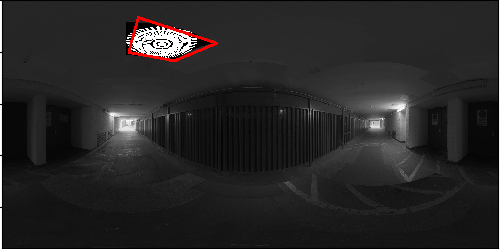  

こっちは形状まで推定できている．  
本当は10点以上の点対応をとってfindHomography()からホモグラフィ行列を計算すればいいのだが
10点も取れないことが多かったため5点の加算平均で中央を推定している．  
推定した中央の座標がキューブマップのどの点に対応するかを計算し，そこからマーカーの大きさぶん
を考慮した四隅をエクイレクタングラー形式に送るという事をやっている．ここをもう少し何とかすれば計算は速くなるはず．  
```python:Cube2Eq.py
def find_Cubemap_corresponding_pixel(pos_x,pos_y,width,height,n):
    
    posx,posy=normalized_coordinates(get_Cubemap_face(pos_x,pos_y,n), pos_x, pos_y, n)
    for ycoord in range(0, height-1):
        for xcoord in range(0, width-1):
            corrx, corry = find_corresponding_pixel(xcoord, ycoord, width, height, n)
            if((pos_x-corrx)**2 + (pos_y-corry)**2<=100):
                #print('true')
                #print('called',pos_x,pos_y)
                #print('->',xcoord,ycoord)
                return xcoord,ycoord
            
            #outimg.putpixel((xcoord, ycoord), inimg.getpixel((corrx, corry)))
            #outimg[ycoord,xcoord,0]= inimg[corry,corrx,0]
            #outimg[ycoord,xcoord,1]= inimg[corry,corrx,1]
            #outimg[ycoord,xcoord,2]= inimg[corry,corrx,2]
            #print(xcoord)
    return 0,0
```
キューブマップ上の座標からエクイレクタングラー形式の座標を計算するアルゴリズムはfind_corresponding_pixel()関数をもとに作った．
点対応が1対1でないので
```python:Cube2Eq.py
            if((pos_x-corrx)**2 + (pos_y-corry)**2<=100):
```
とすることでエラーをなるべく避けている(エラーを吐くときもたまにある)．
ここの右辺を調整すれば検出の精度を高めたり計算が速くなったりするかもしれない．

### CNNベース
思い付きでやってみたが思いのほか精度がよくなかったのでお蔵入りした．本当は既存のモデルやら
ちゃんとベースのある何かを使うべき．

```python:EqMatchingLib.py
def MatchingByCNN(Eq_Input,Eq_Label=np.zeros(4),weights=None):
    height,width=Eq_Input.shape
    model=CNNModel(width,height)
    expect=np.zeros((4,1,1))
    if(weights!=None):
        model.load_weights(weights)
        Eq_Input=Eq_Input.reshape(1,width,height,1)
        expect=model.predict(Eq_Input,batch_size=1)
    tl=[int(expect[0][0][0]),int(expect[1][0][0])]
    tr=[int(expect[0][0][0]),int(expect[3][0][0])]    
    br=[int(expect[2][0][0]),int(expect[3][0][0])]
    bl=[int(expect[2][0][0]),int(expect[1][0][0])]
    pts=[np.array([tl,tr,br,bl])]

    tl_l=[Eq_Label[0],Eq_Label[1]]
    tr_l=[Eq_Label[2],Eq_Label[1]]
    br_l=[Eq_Label[2],Eq_Label[3]]
    bl_l=[Eq_Label[0],Eq_Label[3]]
    pts_l=[np.array([tl_l,tr_l,br_l,bl_l])]

    
    Eq_Input=Eq_Input.reshape(height,width,1)
    Eq_Input=Eq_Input
    print(pts)
    res=cv2.cvtColor(Eq_Input,cv2.COLOR_GRAY2RGB)
    cv2.polylines(res, pts, True, (0,0,1), thickness=10, lineType=cv2.LINE_8, shift=0)    
    res=cv2.cvtColor(res,cv2.COLOR_BGR2RGB)
    
    plt.imshow(res)
    plt.show()
```

# 検出できてないもの
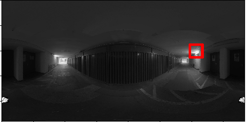  
テンプレートがエクイレクタングラー形式で二つに分裂している場合(画像はテンプレートマッチのときの結果だがakazeでも大きいほうの長方形を描画してしまう)

これに関してはエクイレクタングラー形式のほうでpaddingをどうにかすれば対処はできるはず．

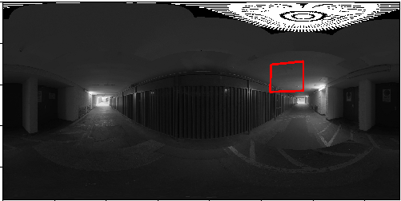
緯度が大きすぎるもの  
この辺は周辺画像との兼ね合いもあるがさすがに厳しい．どうせキューブマップに展開しているならキューブマップ上で画像認識すればいいがそれも問題が生じるらしい [^1]．

[^1]: 井上 慶彦 (2018)"全方位カメラを用いた物体検出とトラッキング ~視覚障害者支援システムの実現に向けて",情報処理学会研究報告

## 使い方
*** 

Train.pyとmain.pyをそれぞれ必要な引数に数字なり文字なりを入れて実行すればよい．
### Train.py
モードは
- create
    - 引数はCubemapImg,template,SavingData,SavingLabel,num
- train
    - 引数はUsingData,UsingLabel,weights,batch_size,nb_epoch
のみ
createはランダムな位置にマーカーが貼られたエクイレクタングラー画像をnumの数だけ生成する．
元のキューブマップ，テンプレートと画像セットのサイズ，画像セットの保存先のファイル，画像セットのテンプレートの左上と右下の位置の記録先を指定する．

trainはCNNの学習をさせる．
バッチサイズ，エポック，学習済みの重みがあればそれを指定し，学習に用いる画像セットとラベルを引数として指定する．

### main.py
モードは
- TMatch
    - 引数はUsingData,UsingLabel,template,num
- AKAZE
    - 引数はUsingData,UsingLabel,template,num
- CNNMatch
    - 引数はUsingData,UsingLabel,weights,num

TMatchはテンプレートマッチ，使用する画像セットをUsingDataに指定し，その何番目から認識をするかをnumで指定する．テンプレートが必要だがLabelは正解とのずれを確認するためのみ用いている．
AKAZEはakaze特徴量マッチ，引数はTMatchと一緒
CNNMatchはCNNを使ったやつ．TMatchとかに加えて学習済みの重みを指定して実行する．

